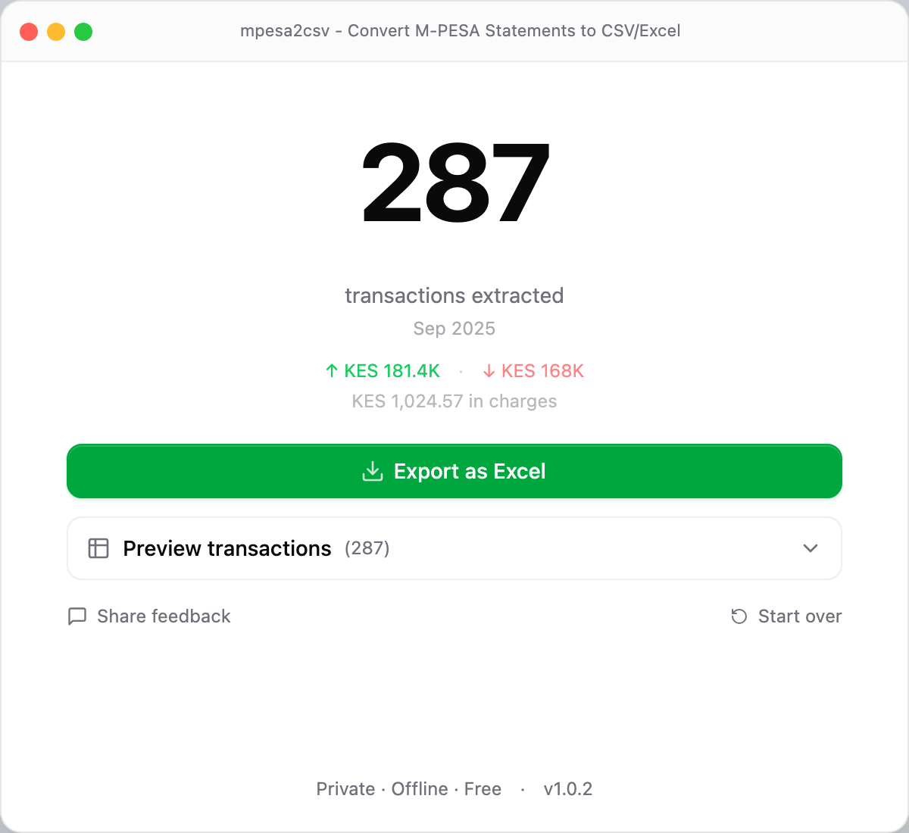

<div align="center">
  

  # mpesa2csv

  **M-PESA statements → Excel & CSV. On your laptop.**

  [](https://github.com/DavidAmunga/mpesa2csv/releases)
  [](https://opensource.org/licenses/MIT)
  [](https://github.com/DavidAmunga/mpesa2csv/releases)
  [](https://github.com/DavidAmunga/mpesa2csv/releases)
  [](https://github.com/DavidAmunga/mpesa2csv/blob/main/CONTRIBUTING.md)
  [](https://tauri.app/)

  Free desktop app that unlocks and converts M-PESA Statement PDFs to CSV, Excel, JSON, and more — entirely offline.

  [Website](https://mpesa2csv.com) • [Download](https://github.com/DavidAmunga/mpesa2csv/releases/latest) • [Changelog](./CHANGELOG.md) • [Contributing](./CONTRIBUTING.md)

</div>

<div align="center">
  
</div>

---

## Why

M-PESA Statement PDFs arrive password-locked. mpesa2csv unlocks them on your machine, extracts the ledger, and exports a spreadsheet you can actually use — no upload, no account.

## Features

### Convert locally

- Unlock password-protected M-PESA Statement PDFs on device
- Personal and paybill statements
- Batch convert multiple PDFs in one session
- Preview transactions before you export

### Export formats

- **CSV** — UTF-8 for Excel / Google Sheets
- **Excel (XLSX)** — formatted workbook with optional analysis sheets
- **JSON** — for scripts and integrations
- **OFX / QFX / QIF** — experimental accounting exports
- **Webhook** — POST extracted JSON to your own API after local processing

### Excel analysis sheets

Optionally include sheets for money in/out, charges, reversals, cash-flow summary, monthly/weekly breakdown, daily balance, amount distribution, top contacts, recurring payments, time-of-day patterns, and day-of-week activity.

### Privacy

- Processing stays on your computer
- No cloud upload, no account
- Free and open source for Windows, macOS, and Linux

## Installation

Download the latest release from [GitHub Releases](https://github.com/DavidAmunga/mpesa2csv/releases/latest) or [mpesa2csv.com](https://mpesa2csv.com):

| Platform | File |
| --- | --- |
| **Windows** | `.exe` installer |
| **macOS** | `.dmg` (Intel & Apple Silicon) |
| **Linux** | `.AppImage` or `.deb` |

The app can update itself when a new version is available.

## Usage

1. Drop in one or more M-PESA statement PDFs
2. Enter the statement password if prompted (stays on your machine)
3. Preview the extracted ledger
4. Export CSV or Excel — open the file from the confirmation chip when it finishes

## Development

### Prerequisites

- [Node.js](https://nodejs.org/) v18+
- [Rust](https://www.rust-lang.org/tools/install) v1.70+
- [pnpm](https://pnpm.io/) v10+
- Java JRE (bundled for Tabula during setup/build)

### Stack

- [Tauri v2](https://tauri.app/) + React + TypeScript
- Tailwind CSS + Radix UI
- [Tabula](https://tabula.technology/) for PDF table extraction
- ExcelJS / PapaParse for exports

### Setup

```bash
git clone https://github.com/DavidAmunga/mpesa2csv.git
cd mpesa2csv
pnpm install
pnpm run tauri:dev
```

### Scripts

```bash
pnpm run dev              # Vite only
pnpm run tauri:dev        # Full desktop app
pnpm run tauri:build      # Production build
pnpm run setup-jre        # Bundle JRE for Tabula
pnpm run shots:fixture    # Build sample fixture for marketing screenshots
pnpm run shots:capture    # Capture UI shots (writes assets/shots + site/public/shots)
```

## Contributing

1. Fork the repo
2. Create a branch: `git checkout -b feat/your-feature`
3. Add a changeset when your change is user-facing: `pnpm changeset`
4. Open a PR

See [CONTRIBUTING.md](./CONTRIBUTING.md) for details.

## Changelog

See [CHANGELOG.md](./CHANGELOG.md). The marketing site also pulls the main-channel changelog from this file.

## Privacy

All statement processing runs locally. Statements and passwords are not uploaded.

## License

MIT — see [LICENSE](./LICENSE).

## Acknowledgements

- [M-PESA](https://www.safaricom.co.ke/personal/m-pesa) by Safaricom
- [Tabula](https://tabula.technology/)
- [Tauri](https://tauri.app/)
- [Contributors](https://github.com/DavidAmunga/mpesa2csv/graphs/contributors)

---

<div align="center">
  Made by <a href="https://davidamunga.com">David Amunga</a>
</div>
